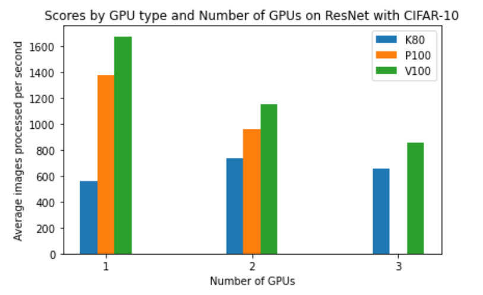

# Running multi-GPU jobs on MASSIVE M3
Machine learning models and the datasets they train on continue to grow in size,
increasing the time required to train models sufficiently. One method for 
accelerating the code is to spread the work among multiple GPUs, with
machine learning software libraries like TensorFlow and PyTorch making
distributed code simpler to write.

In general, the same advice for single GPU jobs applies for multi-GPU jobs,
with the caveat that not all single GPU jobs automatically scale to multiple 
GPUs - you will likely need to make code modifications to utilise
multiple GPUs. The other caveat is that while multiple GPUs have the 
potential to significantly accelerate your code, they can also make code
less efficient. If you're running a small model, adding a GPU may introduce 
overhead communication costs that slow your code overall. It's also 
important to recognise that some GPUs are more powerful for machine 
learning than others. A K80 GPU is not especially suited to machine learning, 
and you may find running with multiple K80s increases efficiency. The same code 
may reach maximum efficiency on only a single V100 GPU, which is more
powerful and well-suited for machine learning. It's always worth benchmarking how
your code scales as you add GPUs.

The P4 GPUs aren't availble outside of desktops, but you can access our P100 and V100 GPUs - 
you may remember in our single GPU jobs we submitted to the P100 nodes.
In general, V100s are more powerful than P100s, and you can only access 2 P100s on one node,
versus 3 V100s on a single node. In these examples we'll stay on the P100  
nodes, as the queue time is usually a little shorter.

# Submitting multi-GPU jobs to the cluster
## Interactive smux jobs
While you can access two K80 GPUs on M3 using the Strudel desktop interface,
the wait time to obtain a K80 desktop is longer, and the P4 GPUs tend to 
be better suited for machine learning jobs. When you progress to multi-GPU
jobs, we advise you move to job submission. If you want to test
your multi-GPU code before writing your job submission script, you can access
multiple GPUs interactively with `smux`, a tool on M3 which combines `srun`
and `tmux`. 

An `smux` job will submit a job to the cluster which requests resources - 
once you obtain these resources, you will be able to connect to a compute
node with them, similarly to how a desktop gives you access to a compute node.
While we won't explain `smux` in depth here, the commands are very similar to 
the ones in a job script.

Consider the commands from our single GPU MNIST job:

```
export REPODIR=/scratch/<project>/$USER/gpu-examples
cat ${REPODIR}/M3-GPU-jobs/single-gpu-examples/mnist_job.bash | head -n16

#!/bin/bash
#SBATCH --job-name=mnist_job

# Replace this with your email address
# To get email updates when your job starts, ends, or fails
#SBATCH --mail-user=youremail@domain.com
#SBATCH --mail-type=BEGIN,END,FAIL

# Replace <project> with your project ID
#SBATCH --account=<project>

#SBATCH --time=00:30:00
#SBATCH --ntasks=6
#SBATCH --gres=gpu:1
#SBATCH --partition=m3h
#SBATCH --mem=55G
```
In general, to get a default `smux` job, we'd run the command `smux new-session`. 
If we wanted to replicate our single job conditions, we would run:

```
smux new-session --time=00:30:00 --ntasks=6 --gres=gpu:1 --partition=m3h --mem=55G
```
You can see we've just mirrored the key settings from our job into the `smux` command. You can
inspect your job status with `squeue`, `sacct`, and `show_job` as usual, and connect
to your running `smux` session with the `smux attach-session` command. Once attached,
you'll have access to a compute node with a GPU to run on. For multiple GPUs, you would alter
the `gres` command to request more GPUs or a different partition. For 3 V100s for example,
`--gres=gpu:3 --partition=m3g` would work. In general, due to the wait time for interactive sessions, 
it's best to submit jobs where possible instead.

## Submitting multi-GPU jobs
If you inspect the files `mnist_job_multi.bash` and `resnet_job_multi.bash` in this directory, 
you'll notice they look very similar to scripts submitted for single GPU jobs. Both scripts have been
adjusted to run on 2 P100 GPUs. The main changes in both jobs are:

- The `--job-name` has been changed
- To request 2 GPUs, we now have `--gres=gpu:2`
- The MODEL_DIR directory has changed
- To request 2 GPUs, we set `NUM_GPU=2` 
- In the line where we run our Python script, we have set `--distribution_strategy=mirrored`. As 
  explained in the [TensorFlow documentation](https://www.tensorflow.org/guide/distributed_training),
  the `mirrored` setting "supports synchronous distributed training on multiple GPUs on one machine."

You can submit these jobs with `sbatch mnist_job_multi.bash` and `sbatch resnet_job_multi.bash`.

# Comparing our GPU runs
Sometimes adding GPUs doesn't improve your job performance - there is a communication overhead
when introducing additional GPUs that has the potential to mitigate any performance improvements. 
The ResNet example provided uses a small dataset, CIFAR-10, and is unlikely to benefit from additional
GPUs. This graph compares the examples processed per second on different GPUs 
and numbers of GPUs. Note, there are only 2 P100s 
on a single node in M3, so we haven't included data for 3 P100 GPUs.



This graph demonstrates a few things - a V100 is the most efficient for this particular job,
which is expected per our [machine learning benchmarks](https://www.ml4au.community/tools/benchmarking-gpus).
More interestingly however, it demonstrates that 2 K80s perform slightly better than a single K80, 
but adding a third K80 starts to degrade performance. The more
powerful P100 and V100 GPUs don't benefit from any additional GPUs, reaching performance capacity with a 
single GPU on the small dataset. The number of GPUs for the best job performance will depend on the 
type of GPU you're using.

It's important to perform similar tests when running your deep learning code to understand
if your performance genuinely improves with more GPUs - there's no point waiting in the queue 
for multiple GPUs if you only need one! The examples ran here also demonstrate best practice, 
and have high GPU utilisation, which can impact the efficiency of your job considerably.

This sort of benchmarking is helpful when applying for access to our specialised 
[DGX GPUs](https://docs.massive.org.au/communities/dgx.html), 
which have 8 GPUs on a single node. 
If we see your performance continues to improve with 3 V100 GPUs, then granting access
to the DGX partition is straightforward. 
If your model reaches peak performance on 2 K80s, it's less likely 
you will benefit from access to the specialised DGX resource and we can advise accordingly. 
